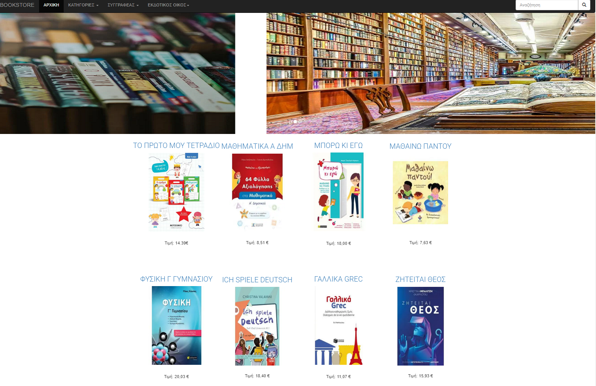

# 📚 Bookstore Web Application
### Django | Python | Full-Stack Web Development

A full-stack web application that simulates an online bookstore, developed using **Django** following the **MVT (Model–View–Template)** architecture.

This project was created as part of a Software Development course and demonstrates backend design, database modeling, filtering logic, and dynamic content rendering.

---

## 👩‍💻 Authors: Ganara Vasiliki, Karanikolidis Dimitris, Fostiropoulou Despoina

---

## 🚀 Features

### 📖 Book Management
- Create and store books in the database
- Display book listings
- Detailed book view pages
- Publication dates

### 🔍 Search & Filtering
- Keyword search (title & description)
- Filter by:
  - Category
  - Author
  - Publisher

### 📄 Pagination
- Paginated results for improved usability

### 🧩 Backend Logic
- Django ORM models
- Relational database design
- Dynamic queries
- Clean separation of concerns (MVT)

---

## 🛠 Tech Stack

| Layer        | Technology |
|-------------|-----------|
| Backend     | Python, Django |
| Database    | SQLite (default Django DB) |
| Frontend    | HTML, CSS, Templates |
| Tools       | Git, GitHub |

---

## 📂 Project Structure

bookstore/

│

├── models.py # Database models

├── views.py # Business logic & routing

├── templates/ # HTML templates

├── static/ # CSS / assets

├── manage.py

├── db.sqlite3

└── README.md

---

## 🖥 UI Preview 

 

---

## 🧠 Learning Outcomes

This project demonstrates the end-to-end development of a full-stack web application using Django, focusing on clean architecture, database modeling, and maintainable backend design.

Through the implementation of this bookstore platform, the following were practised: 

- Backend web development with Django
- Database schema design
- ORM relationships (Foreign Keys)
- Query filtering & search
- Pagination
- MVC/MVT architecture
- Git version control
- Project structuring for production-ready repositories
